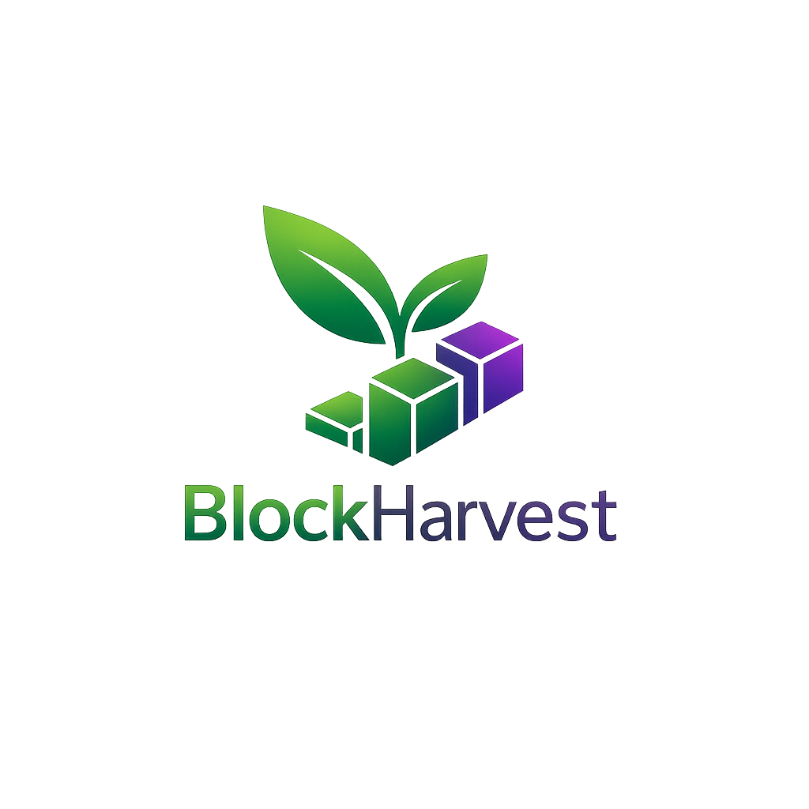

<p align="center">
  
</p>

<h1 align="center">BlockHarvest</h1>

<p align="center">
  <strong>Crop insurance on Solana — premiums and payouts settled on-chain, verifiable by anyone.</strong>
</p>

<p align="center">
  <a href="https://block-harvest-qk3j.vercel.app/"><strong>Live demo →</strong></a>
  &nbsp;·&nbsp; Solana Devnet &nbsp;·&nbsp; Phantom / Solflare wallet required
</p>

<p align="center">
  
  
  
  
  
  
</p>

---

## The problem

Smallholder farmers wait weeks or months for crop-insurance payouts, and have no way to check where their premium went or why a claim stalled. The insurer's ledger is a black box.

## The idea

Put the money and the policy state on a public blockchain. A farmer's premium goes into a vault owned by a smart contract — not a company bank account — and every payment and payout is a transaction anyone can audit on Solana Explorer. The database is only used for things that don't need to be trustless (names, crop types, dashboard stats).

## Features

- **Wallet sign-in** — connect Phantom or Solflare; your wallet address *is* your identity.
- **On-chain policy account** — registering creates a per-farmer account (PDA) owned by the program.
- **Premium payments** — pay 0.1 SOL into a program-controlled vault; the policy flips to *active* on-chain.
- **Admin-governed claims** — a designated admin wallet files and approves claims; approval releases SOL from the vault to the farmer.
- **Public ledger** — every transaction links to Solana Explorer.
- **Live dashboard** — farmer count, volume, premium vs. payout totals, and a network-wide farmer table.

## Architecture

```
┌──────────────────────────┐        sign tx        ┌──────────────────────┐
│  Next.js 16 (browser)    │ ────────────────────▶ │  Phantom / Solflare  │
│  - wallet adapter        │ ◀──────────────────── │  wallet              │
│  - Anchor JS client      │      signed tx        └──────────────────────┘
└──────┬─────────────┬─────┘
       │ RPC         │ REST (anon key)
       ▼             ▼
┌──────────────┐  ┌─────────────────────────────────┐
│ Solana       │  │ Supabase (Postgres)             │
│ block_harvest│  │ farmers · transactions ·        │
│ program      │  │ dashboard_stats (view)          │
│  ├ Farmer PDA│  └─────────────────────────────────┘
│  └ Vault PDA │   off-chain: profile + ledger index
└──────────────┘   on-chain: money + policy state
```

**Design rule:** anything that involves money or policy status lives on-chain and is the source of truth. Supabase is a convenience index for fast reads and human-readable profile data.

## Smart contract

Anchor program (`block-harvest/programs/block-harvest/src/lib.rs`) · Devnet ID `C54J4haBjNNGYfV8ZENqvDRzvhX5ReeJPjyCVnySbdXj`

| Instruction | Caller | Effect |
|---|---|---|
| `initialize_vault` | anyone (once) | Creates the vault PDA that holds premiums |
| `register_farmer` | farmer | Creates the farmer's policy PDA |
| `pay_premium` | farmer | Transfers 0.1 SOL farmer → vault, sets `premium_paid` |
| `file_claim` | admin | Requires paid premium; sets `claim_filed` |
| `approve_claim` | admin | Requires filed claim; moves SOL vault → farmer, sets `claim_approved` |

**Accounts**

```
Farmer PDA  seeds ["farmer", wallet]   farmer · premium_paid · premium_amount ·
                                       payment_timestamp · claim_filed · claim_approved · bump
Vault PDA   seeds ["vault"]            bump   (lamports = pooled premiums)
```

**Safety checks enforced on-chain:** no double premium, no claim without a premium, no double filing or approval, admin-only claim actions, payout wallet must match the policy owner, and payouts can't drain the vault below rent-exempt minimum.

## Tech stack

| Layer | Tech |
|---|---|
| Smart contract | Rust, Anchor 0.29 |
| Chain | Solana Devnet |
| Frontend | Next.js 16 (App Router), React 19, TypeScript, Tailwind CSS 4 |
| Wallets | Solana Wallet Adapter (Phantom, Solflare) |
| Data | Supabase Postgres with RLS |
| Hosting | Vercel |

## Project structure

```
block-harvest/
├── programs/block-harvest/src/lib.rs   # Anchor program
├── Anchor.toml
└── app/                                # Next.js frontend
    ├── app/
    │   ├── page.tsx                    # landing
    │   ├── register/page.tsx           # on-chain registration + profile
    │   ├── dashboard/page.tsx          # policy status, pay premium, network stats
    │   ├── transactions/page.tsx       # public ledger
    │   └── providers.tsx               # wallet + RPC providers
    ├── components/                     # header, footer, policy modal
    ├── lib/anchor.ts                   # IDL, program client, PDA helpers
    ├── lib/supabase.ts                 # DB client, ledger + stats queries
    └── supabase/schema.sql             # tables, view, RLS policies
```

## Run it locally

**Prerequisites:** Rust (toolchain pinned in `rust-toolchain.toml`), Solana CLI, Anchor CLI, Node 20+, a Supabase project, Phantom with Devnet SOL ([faucet](https://faucet.solana.com)).

```bash
git clone https://github.com/TheNobady/blockHarvest.git
cd blockHarvest/block-harvest

# 1 — contract (optional: the frontend can use the already-deployed program)
solana config set --url devnet
cargo build-sbf --manifest-path programs/block-harvest/Cargo.toml --sbf-out-dir target/deploy
solana program deploy target/deploy/block_harvest.so

# 2 — database: run app/supabase/schema.sql in the Supabase SQL editor

# 3 — frontend
cd app && npm install
# create .env.local with the values below
npm run dev                  # http://localhost:3000
```

`.env.local`

```env
NEXT_PUBLIC_SUPABASE_URL=https://<project>.supabase.co
NEXT_PUBLIC_SUPABASE_ANON_KEY=<anon key>
NEXT_PUBLIC_PROGRAM_ID=C54J4haBjNNGYfV8ZENqvDRzvhX5ReeJPjyCVnySbdXj
NEXT_PUBLIC_RPC_URL=https://api.devnet.solana.com
```

> If you deploy your own program, update `declare_id!` in `lib.rs`, `Anchor.toml`, and `NEXT_PUBLIC_PROGRAM_ID`, and change `ADMIN` in `lib.rs` to your wallet.

## Verify a transaction yourself

Every premium shows a signature in the app. Open:

```
https://explorer.solana.com/tx/<SIGNATURE>?cluster=devnet
```

You'll see the `block_harvest` program invoked, the `pay_premium` instruction, and 0.1 SOL moving from the farmer to the vault PDA — a record no server or admin can edit.

## Roadmap

- [ ] **Parametric triggers** — replace the manual admin with a weather oracle (e.g. Switchboard/Chainlink) so claims auto-approve on drought/rainfall thresholds.
- [ ] **Real coverage** — payout as a multiple of premium based on land size and crop, with a funded risk pool.
- [ ] **Policy terms** — season start/end, renewals, and expiry.
- [ ] **Admin console** in the UI for filing and approving claims.
- [ ] **Trust-minimized ledger** — write Supabase rows from a server/webhook that verifies the signature on-chain, and lock RLS down to read-only for clients.
- [ ] Anchor integration tests and CI.

## Acknowledgements

Built as a showcase project exploring how public blockchains can make agricultural insurance transparent for farmers.
